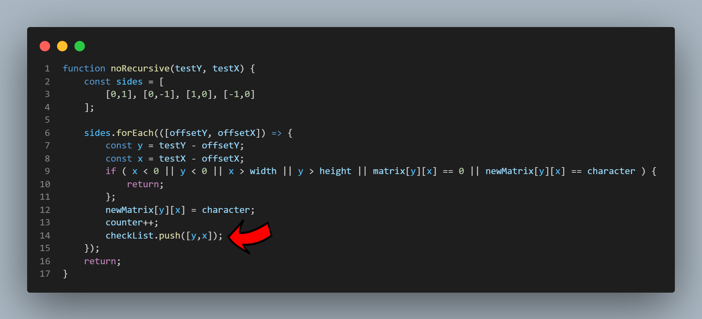

# cleanIslands
JS exercise to identify points connected to the edge of the matrix and clean the points that are islanded.

# Example page
https://maper77.github.io/cleanIslands/

# Link to exercise
https://www.youtube.com/watch?v=4tYoVx0QoN0

When I saw the challenge proposed in this video, I decided to stop watching the video and think of a solution, then I saw that I came to a very similar solution, I believe that for this case it is the most logical way to solve it.

# Problem found

--> Uncaught RangeError: Maximum call stack size exceeded

Using a recursive function works great for a small array, but an array that is too large ends up generating a "Maximum call stack size exceeded" error.
To test the limit of the recursive function I used a 21x100 matrix fully filled with '1', which resulted in 2,100 iterations of the function, whereas with a much larger matrix the non-recursive function had no problem.

# Solution found:

The solution found was to stop using recursive function and make a stack of values to be checked that feeds itself.
I noticed a performance increase of about 5%.

I kept the 2 versions for testing and comparisons.

## Recursive function:
cleanIslands.js

## No recursive function:
cleanIslandsNoRecursive.js

